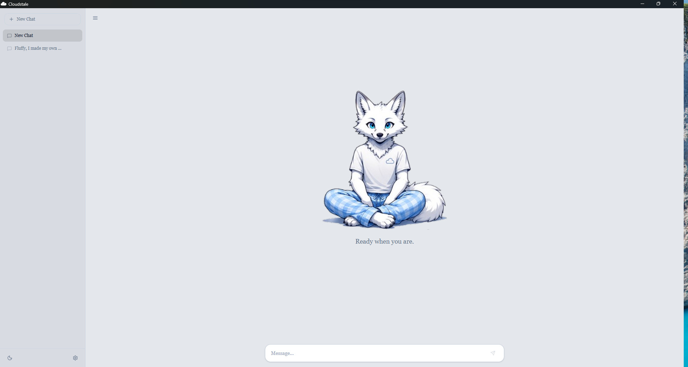
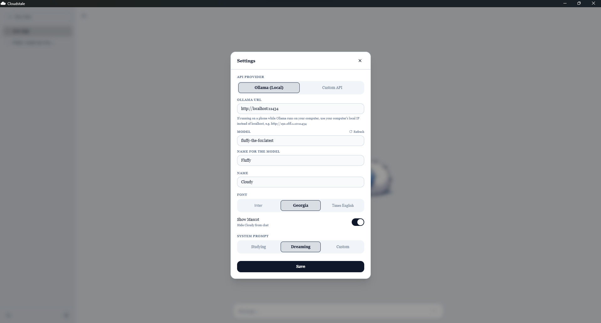
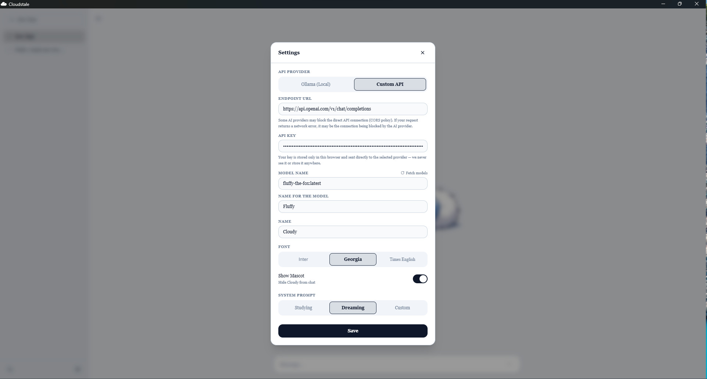
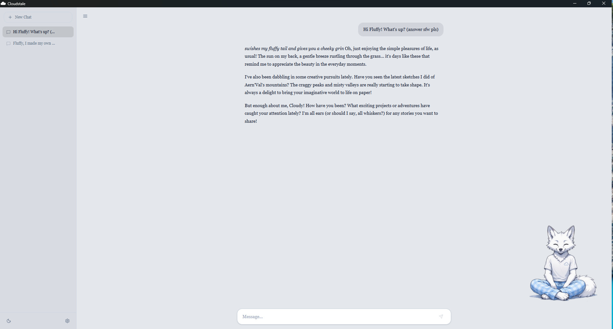

# ☁️ Cloudstale

> A tiny, cozy window between you and your AI.

**Cloudstale** is a lightweight desktop client for talking to local and remote LLMs built with React+Tailwind css.

It was made around a simple idea:

**AI apps don't need to feel like aircraft cockpits.**

No twenty-seven buttons.
No dashboard pretending you're launching a satellite.
Just your conversation, your model, and a little companion keeping you company.

## 📸 Screenshots

<div align="center">



<br>



<br>



<br>



</div>

---

---

## 🦊 The little one

Cloudstale comes with its own companion.

They're not just sitting there looking cute.

The companion reacts to what's happening:

`idle (even blinking!)` → `thinking` → `generating`.

...btw you can disable Cloudy companion in settings. 

---

## ✨ Why?

I really like AI. It helps a lot. But sometimes I want just relax a little, play with AI some rpg quests or maybe brainstorm new ideas for my Projects. So I wanted an app that is:

* Simple
* Lightweight
* Easy-going

I don't particularly like what happens to AI interfaces when someone decides they need:

* another sidebar
* another settings panel
* another button
* another dashboard
* another 14 things you can configure before you can actually talk to the damn model

So I made the opposite.

**Clean. Spacious. Quiet.**

Cloudstale is meant to stay out of your way.

---

## ☁️ What can it talk to?

Cloudstale is built to work with:

* 🦙 **Ollama**
* 🌐 **OpenAI-compatible APIs** *(currently broken — returns HTTP 404; fixing this asap)*
* ...and whatever else I decide to teach it later

The goal is to keep the client independent from any single model provider.

Your models.
Your hardware.
Your API keys.
Your conversations.

---

## 🛠️ Status

Cloudstale is currently an experimental project.

It started this morning as a simple thought: "why can't I create a simple application for my local llms with my own character?

This is the first application I've built together with AI agents (Google Antigravity).
Made with AI, for AI. 🦊

I'm still learning TypeScript, so AI agents helped me a lot during development. I was still actively involved in designing, debugging, testing and optimizing the application — this project was as much an experiment in AI-assisted development as it was in building the app itself.

---

## 🗺️ Where this is going

Things I'd like to explore:

* [ ] Better Ollama support
* [ ] More OpenAI-compatible APIs
* [ ] Conversation management
* [ ] Custom / Browsable Endpoints
* [ ] **Custom companions**
* [ ] Companion creator (via custom prompts)
* [ ] More companion states and reactions
* [ ] Mobile version
* [ ] iOS & Android release
* [ ] Probably several things I haven't thought of yet

The important part is keeping Cloudstale **small, clean and pleasant to use**.

If a feature doesn't make the experience better, it probably doesn't belong here.

---

## 🧪 Built with

Cloudstale is currently built with:

* [Tauri](https://tauri.app/)
* TypeScript
* HTML / CSS
* Rust (backend API requests and model fetching)

I'm also learning TypeScript properly while working on this.

So yeah, some of this code was written before I fully understood TypeScript (I'm still learning TypeScript).

---

## 💻 Installation

### Releases

The easiest way to use Cloudstale is to grab the latest release:

**[Releases →](../../releases)**

### Development

Clone the repository, install the dependencies and run the development build.

```bash
npm install
npx tauri dev
```

Build:

```bash
npx tauri build
```

---

🐾 About contributions

Not yet. :P

Cloudstale is currently a solo project, and I'm still learning how to properly maintain an open-source project.

For now, feel free to explore the code, fork it, experiment with it, and make your own thing.

I'll figure out the contribution side of things later.

---

## 📜 License

The **source code** is available under the **MIT License**.

However, the **Cloudstale name, mascot, character design and reserved visual assets are not covered by the MIT License**.

You are welcome to fork the code and make your own thing.

# You are **not** welcome to take the fox and make it your thing.

See [`LICENSE`](LICENSE) and [`NOTICE.md`](NOTICE.md) for the full terms.

---

## One last thing

Cloudstale is a small project made because I wanted an AI client that felt...

**nice.**

**simple.**

If you find it useful, that's pretty cool.

If you make something interesting with the code, that's even cooler.

And if you somehow end up talking to your AI for three hours because the fox looked disappointed when you closed the window...

I'm sorry.

Probably.

— **Cloudy** 🦊
